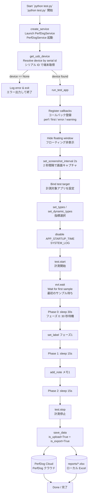
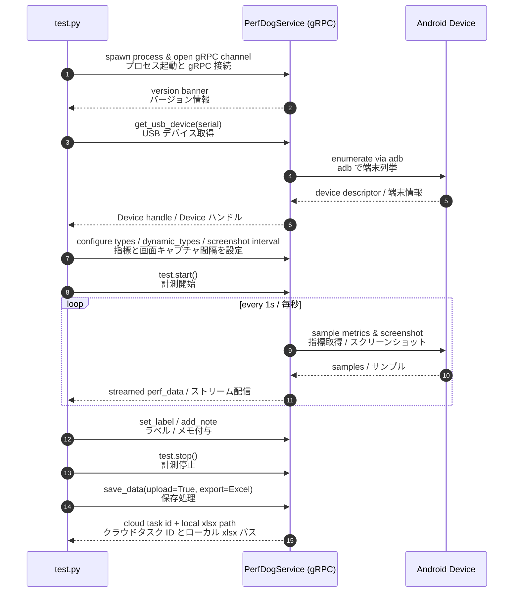

# `test.py` Guide / `test.py` ガイド

This document explains how `test.py` collects performance data from a USB-connected Android device using **PerfDogService**, and how it exports the result both to the PerfDog cloud and to a local Excel file.

本ドキュメントでは、`test.py` が **PerfDogService** を使って USB 接続された Android 端末から性能データを取得し、PerfDog クラウドおよびローカル Excel ファイルへ出力する仕組みを説明します。

---

## 1. Prerequisites / 前提条件

| Item / 項目 | Requirement / 要件 |
|---|---|
| Python | 3.10 (recommended) / 3.10（推奨） |
| Packages / パッケージ | `grpcio` (>=1.48), `protobuf` 4.25.x |
| PerfDogService binary / バイナリ | Path configured in `config.py` (`SERVICE_PATH`) / `config.py` の `SERVICE_PATH` で指定 |
| Device / 端末 | Android with USB debugging enabled / USB デバッグ有効な Android |
| Test target / 計測対象 | `com.proximabeta.nikke` (NIKKE) installed and runnable / NIKKE がインストール済みかつ起動可能 |

> macOS users: if Gatekeeper blocks the binary, run
> `xattr -dr com.apple.quarantine "<PerfDogService dir>"` once.
>
> macOS の場合、Gatekeeper にブロックされたら一度だけ
> `xattr -dr com.apple.quarantine "<PerfDogService dir>"` を実行してください。

---

## 2. End-to-end flow / エンドツーエンドの処理フロー



---

## 3. Sequence between Python script, PerfDogService and the device / Python スクリプト・PerfDogService・端末間のシーケンス



---

## 4. Code map / コードマップ

```text
test.py
├─ main()                       ← entry point / エントリーポイント
│   ├─ create_service()         ← spawn PerfDogService / PerfDogService 起動
│   ├─ disable_install_apk()    ← skip floating-window APK install
│   ├─ get_usb_device(serial)   ← resolve device / 端末取得
│   └─ run_test_app(device, …)  ← actual measurement / 実計測処理
│
└─ run_test_app(device, package_name, types, dynamic_types, enable_all_types)
    ├─ Test(device)                       ← session object / セッション
    ├─ set_*_callback(...)                ← logging hooks / ロギングフック
    ├─ set_floating_window(device)
    ├─ device.set_screenshot_interval(2)  ← 2s screenshots / 2 秒キャプチャ
    ├─ create_test_target_builder(...)    ← bind app / 対象アプリ設定
    ├─ set_types / set_dynamic_types
    ├─ disable_type(APP_STARTUP_TIME / SYSTEM_LOG)
    ├─ test.start() → evt.wait()
    ├─ sleep / set_label / add_note / sleep / sleep
    ├─ test.stop()
    └─ test.save_data(upload + export Excel)
```

---

## 5. Output locations / 出力先

| Channel / 出力先 | Format / 形式 | Where to view / 閲覧方法 |
|---|---|---|
| PerfDog Cloud / PerfDog クラウド | Online task / オンラインタスク | https://perfdog.qq.com → My Tasks → `nikke_YYYYMMDD_HHMMSS` |
| Local file / ローカルファイル | `.xlsx` | `reports/nikke_YYYYMMDD_HHMMSS.xlsx` |
| App icon snapshot / アプリアイコン | `.png` | `reports/nikke_YYYYMMDD_HHMMSS.icon.png` |

> Per-frame screenshots taken via `set_screenshot_interval` are uploaded with the task and only browsable in the cloud console.
>
> `set_screenshot_interval` で取得されるスクリーンショットはタスクと共にクラウドへ送信され、Web コンソールでのみ閲覧できます。

---

## 6. Customizing the timeline / タイムラインのカスタマイズ

The default timeline is 60 seconds (30s warm-up + 15s phase 1 + 15s phase 2). Edit the `try` block in `run_test_app` to fit your scenario.

既定のタイムラインは合計 60 秒（ウォームアップ 30 秒 + フェーズ 1 が 15 秒 + フェーズ 2 が 15 秒）です。`run_test_app` の `try` ブロックを編集してシナリオに合わせてください。

```python
test.start()
evt.wait()

# Warm-up / ウォームアップ
time.sleep(30)

# Phase 1 / フェーズ 1
test.set_label('フェーズ1')
time.sleep(60)                                     # extend as needed / 必要に応じて延長

# Add note at current timestamp (ms) / 現時刻（ミリ秒）にメモ追加
test.add_note('ボス戦突入', int(time.time() * 1000))

# Phase 2 / フェーズ 2
test.set_label('フェーズ2')
time.sleep(60)

test.stop()
```

---

## 7. Common operations / よく使う操作

```bash
# Activate venv / 仮想環境を有効化
source .venv/bin/activate

# List devices / デバイス一覧
python cmds.py getdevices

# List supported metrics for one device / 端末の対応指標一覧
python cmds.py gettypes 2A091FDH300CYB

# List apps on a device / 端末のアプリ一覧
python cmds.py getapps 2A091FDH300CYB | grep -i proxima

# Run a measurement / 計測実行
python test.py

# Stop PerfDogService (mandatory after run, billing-related)
# PerfDogService を停止（実行後に必須、課金関連）
python cmds.py killserver
```

---

## 8. Troubleshooting / トラブルシューティング

| Symptom / 症状 | Likely cause / 原因 | Fix / 対処 |
|---|---|---|
| `service proxy init failed, retry...` keeps printing / が出続ける | Service did not start / Service が起動していない | Check `SERVICE_PATH` in `config.py`, remove macOS quarantine, kill stale `PerfDogService` processes / `config.py` の `SERVICE_PATH` を確認、quarantine 解除、残存プロセスを停止 |
| `device not found` | Wrong serial / not authorized / 誤シリアル・未認可 | `adb devices` confirm + tap "Allow" on phone / `adb devices` 確認後、端末で「許可」をタップ |
| Empty Excel / Excel が空 | App not in foreground or stopped early / 対象アプリが前面でない、早期停止 | Launch NIKKE before `test.start()` and keep it active / `test.start()` 前に NIKKE を起動・前面維持 |
| Screenshot too sparse/dense / スクリーンショットが粗い・多すぎ | Interval too long/short / 間隔が不適切 | Tune `device.set_screenshot_interval(seconds)` / `device.set_screenshot_interval(秒)` で調整 |
| Cloud task not visible / クラウドにタスクが見えない | `is_upload=False` or login mismatch / `is_upload=False` またはログイン不一致 | Set `is_upload=True` and confirm logged-in account / `is_upload=True` を設定し、ログインアカウントを確認 |

---

## 9. Safety / 安全注意

- Always run `python cmds.py killserver` after a measurement session to avoid background sampling and unnecessary billing.
- 計測終了後は必ず `python cmds.py killserver` を実行し、バックグラウンドでの継続収集および不要な課金を防いでください。
- Do not commit secrets (e.g. PerfDog account tokens) to the repository.
- PerfDog アカウントのトークンなどの機密情報をリポジトリにコミットしないでください。
